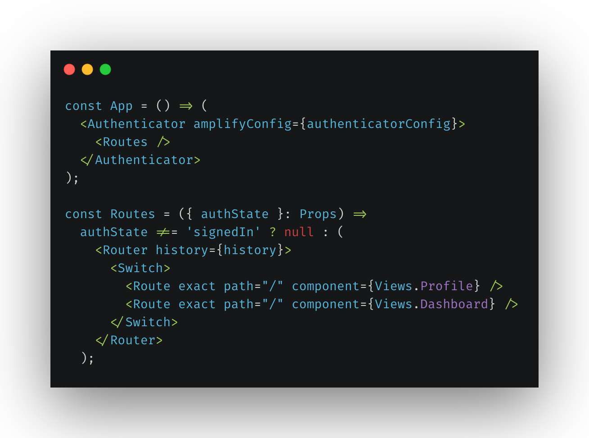

This project was bootstrapped with [Create React App](https://github.com/facebook/create-react-app) 
and use [Aws-amplify](https://aws-amplify.github.io/docs/js/react) with [Cognito-UserPools](https://docs.aws.amazon.com/cognito/latest/developerguide/cognito-user-identity-pools.html) 
to handle basic authentication.

## Cognito-userpools with Authenticator
All routes of the app needed to wrap inside `Authenticator` from [aws-amplify-react](https://github.com/aws-amplify/amplify-js#readme).
It will create `UI` to login, sign-up, reset password and forgot password. 

It will also provide user state as `signedIn` and others that can be used to render Routes.  



The authenticator needs to know which userpool it is pointing to, for that pass below 
userpools credentials as `amplifyConfig`

```javascript
export default {
  aws_cognito_identity_pool_id://cognito identity pool id
  aws_user_pools_id: // user-pools id
  aws_cognito_region: // aws region in which cognito is created
  aws_user_pools_web_client_id:  // web client id from user pools
};

```
Got a different requirement? Don't want to wrap your routes with authenticator?  
you can use other higher order component [withAuthenticator](https://aws-amplify.github.io/docs/js/authentication#using-withauthenticator-hoc)

## Customize UI created by authenticator 
UI created by authenticator can be customized by setting theme properties. 
You can get more details [here](https://aws-amplify.github.io/docs/js/authentication#customize-ui-theme)
```javascript
const MyTheme = {
    signInButtonIcon: { 'display': 'none' },
    googleSignInButton: { 'backgroundColor': 'red', 'borderColor': 'red' }
}

<Authenticator theme={MyTheme} />
```
Customizing entire theme sometimes becomes a headache, to avoid that create your own custom 
UI and use [Auth](https://aws-amplify.github.io/docs/js/authentication) from aws-amplify to do sign-in, signup.
```javascript
import { Auth } from 'aws-amplify';

// For advanced usage
// You can pass an object which has the username, password and other required attributes 

// For signin
Auth.signIn({
    username, 
    password,

}).then(user => console.log(user))
.catch(err => console.log(err));

// For signup
Auth.signUp({
    username,
    password,
    attributes: {
        email,          // optional
        phone_number,   // optional - E.164 number convention
        // other custom attributes 
    },
    validationData: []  //optional
    })
    .then(data => console.log(data))
    .catch(err => console.log(err));
```

## Change default cra configurations
We also used [react-rewired](https://github.com/timarney/react-app-rewired) with [customize-cra](https://github.com/arackaf/customize-cra) to override default webpack configuration that comes with create-react-app.
In this project we have `config-override.js` which is used by `react-rewired` to override webpack configuration.

```
const { override, useEslintRc } = require('customize-cra');

module.exports = override(useEslintRc());

```
Above snippet is to override the default `eslint` configuration, if there is any eslint error it will throw an error while compilation. 
Similar to this `babel` and other `loaders` configurations can be changed.
You can get more details [here](https://github.com/timarney/react-app-rewired#2-create-a-config-overridesjs-file-in-the-root-directory)


## eslint, flow, prettier
To maintain good code indentations and force best practices  there are some eslint, 
flow and prettier configuration. 

Happy coding :) 
