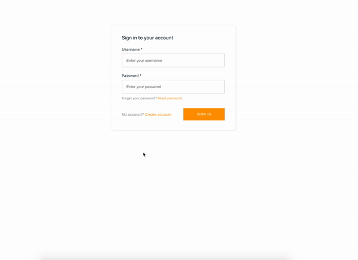
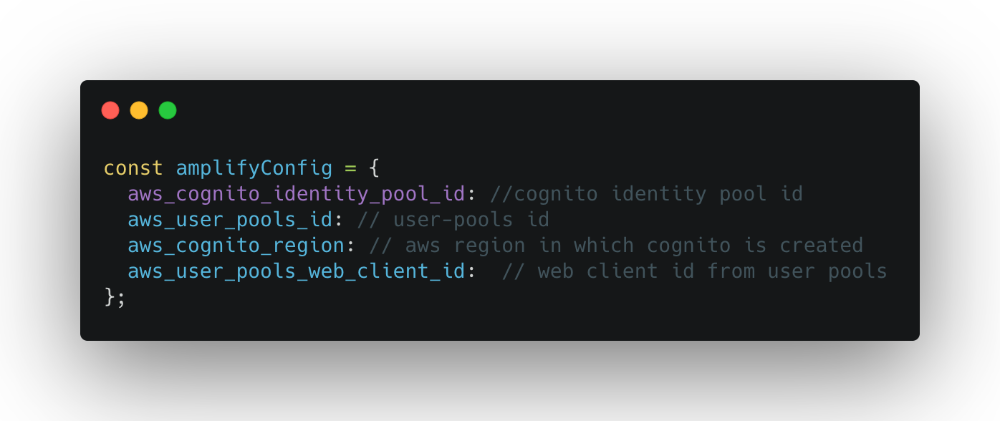
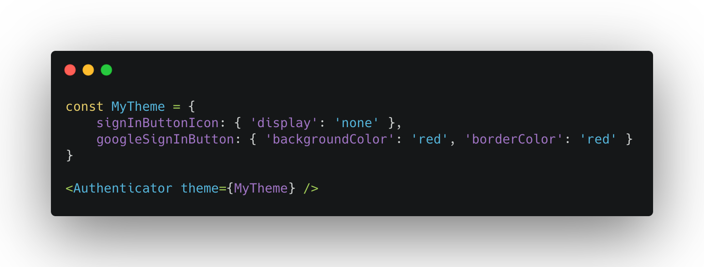
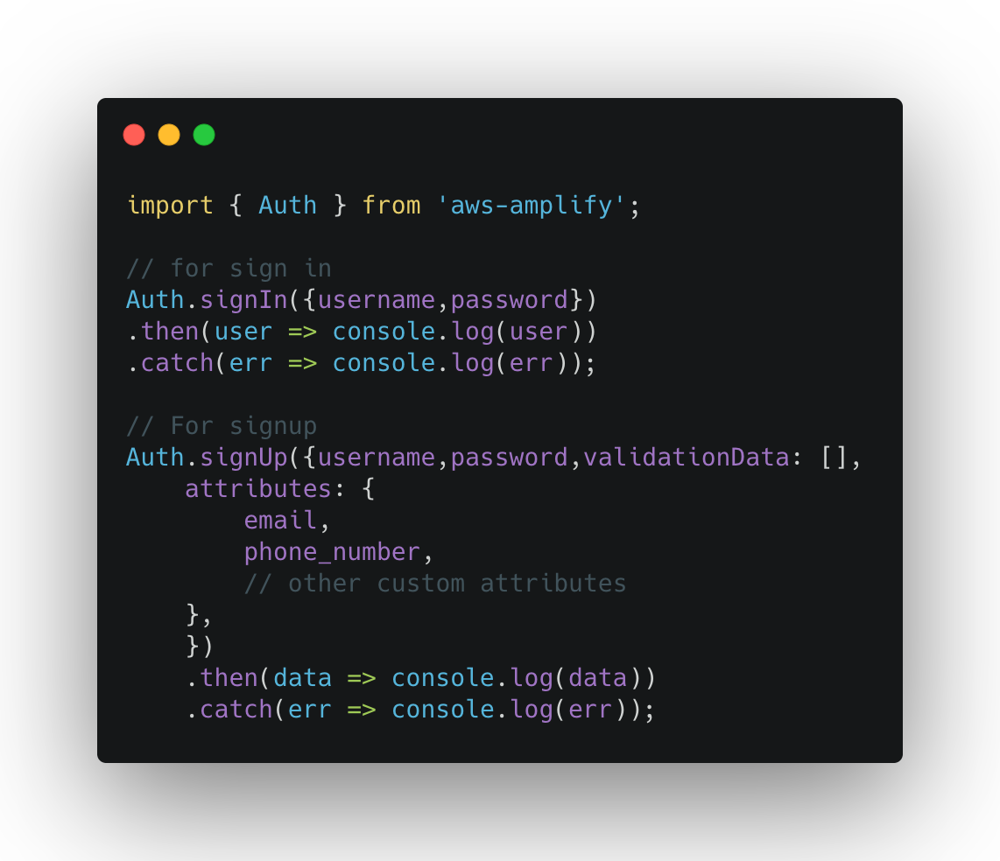
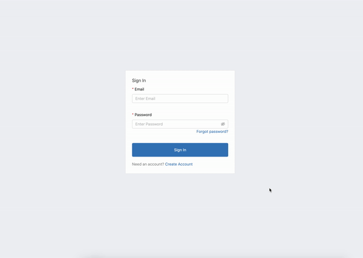

# The Logo ⚛️

#Motivation
Sometimes we need to create an application where we don't have a huge user base, we provide a tool to 
manage already running businesses. We wanted a configuration/way where we can create all user registration
and login related pages in one go and start working on business logic. One of the options we explored and 
we use in some of the projects is [Aws-amplify](https://aws-amplify.github.io/docs/js/react) 
with [Cognito-UserPools](https://docs.aws.amazon.com/cognito/latest/developerguide/cognito-user-identity-pools.html) 
 
Aws-amplify provides us a way to talk to Cognito-UserPools and manages session and all other basic 
authentication parts. Cognito-UserPools helps in managing users by providing basic tools like OTP, EMAIL, 
social logins etc.

#Overview
This project was bootstrapped with Create React App and use Aws-amplify with Cognito-UserPools to handle basic authentication.
We also use [react-rewired](https://github.com/timarney/react-app-rewired) and [customize-cra](https://github.com/arackaf/customize-cra)


## Cognito-userpools with Authenticator
We wrap all routes of the app inside `Authenticator` from [aws-amplify-react](https://github.com/aws-amplify/amplify-js#readme).
It will create `UI` to login, sign-up, reset password and forgot password. 

It will also provide user state as `signedIn` and others that can be used to render conditional Routes.  
 


By doing a configuration like above, it will create a basic UI. See below.



Now, UI is created we need to tell `Authenticator` which Userpool to talk to. We need to pass below credentials
the authenticator as `amplifyConfig` `<Authenticator amplifyConfig={credentials} />`. See config file [here](https://gist.github.com/rhydvik/6cf0f400d83b3bee48826cd0a6bca70e)



There are different approaches to do it, aws-amplify also provides HOC(higher order components). So instead of wrapping
all routes inside `Authenticator` we can use HOC. Read more about [withAuthenticator](https://aws-amplify.github.io/docs/js/authentication#using-withauthenticator-hoc)


## Customize UI created by authenticator 
UI created by authenticator can be customized by setting theme properties. 
You can get more details [here](https://aws-amplify.github.io/docs/js/authentication#customize-ui-theme)



In above approach you can customize some part of UI like, theme color, elements in form fields, look and feel for the form
elements but you can't customize it completely.  

To have a customized theme, we can create our own UI and use API hooks provided by aws-amplify to talk to Cognito-Userpools. 
We can use [Auth](https://aws-amplify.github.io/docs/js/authentication) from aws-amplify to do sign-in, signup with our own custom UI




## Change default cra configurations
We also used [react-rewired](https://github.com/timarney/react-app-rewired) with [customize-cra](https://github.com/arackaf/customize-cra) to override default webpack configuration that comes with 
create-react-app.
In this project we have `config-override.js` which is used by `react-rewired` to override webpack configuration.

```
const { override, useEslintRc } = require('customize-cra');

module.exports = override(useEslintRc());

```
Above snippet is to override the default `eslint` configuration, if there is any eslint error it will throw an error while compilation. 
Similar to this `babel` and other `loaders` configurations can be changed.
You can get more details [here](https://github.com/timarney/react-app-rewired#2-create-a-config-overridesjs-file-in-the-root-directory)

## eslint, flow, prettier
To maintain good code indentations and force best practices  there are some eslint, 
flow and prettier configuration. 

Happy coding :) 
